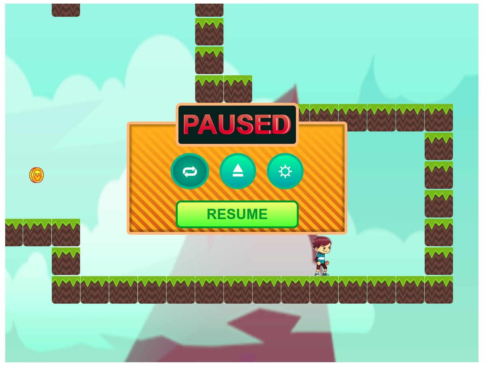

### SAN-KOU7.JS

- try it out [HERE](https://alchemist107.github.io/san-kou7.JS/)

## Description

A 2D platformer built with vanilla javascript , i purposly didn't use canvas to make it hard and to challenge my self to learn new skills, my purpose for this project is to handle multiple states with native JS and handle side effects, i have a lot of trouble doing it my solution was'nt scalable, in my next project i am going to create a js native state managment system.

## Evolution

[HISTORY.md](https://github.com/alchemist107/san-kou7.JS/blob/master/HISTORY.md)

## Product

- try it out [HERE](https://chamsbouzaiene.github.io/san-kou7.JS/)

## credits :

thanks Marijn Haverbeke for his great book Eloquent JavaScript for the Inspiration for this platformer game
